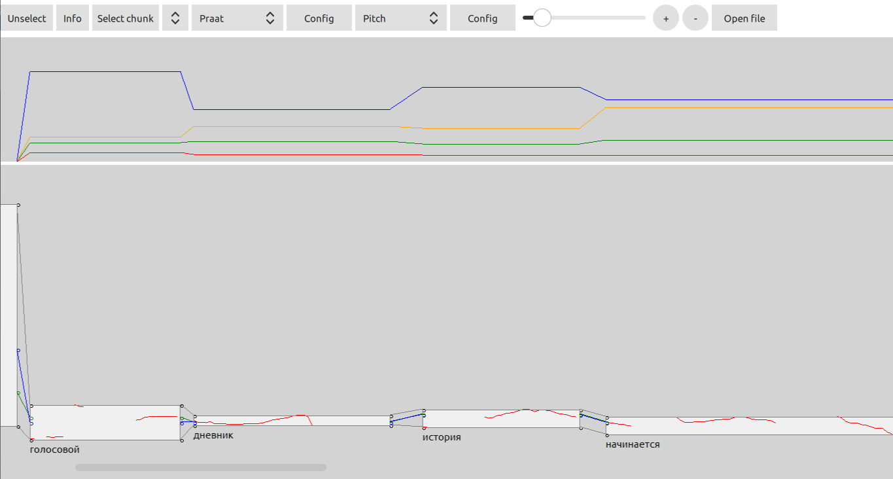
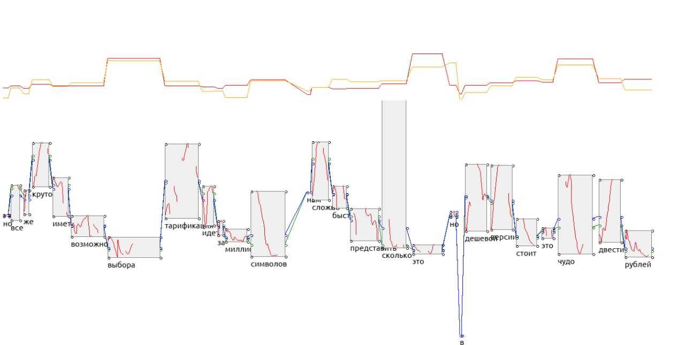
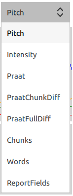
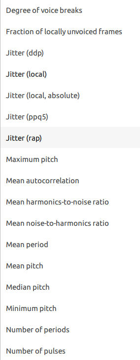

# Diaryth

Diary for psychotherapy

## Proof of concept for diary with following functions:

1) Voice records

2) Text records

3) Custom diary cards

4) Calendar for navigation

5) Psychologic tests engine

6) Visualization of recognized voice records

## Diary cards

Could be parsed from json description, examples could be found at res\cards

## Tests engine

Tests could be parsed from json description, examples could be found at res\tests

## Visualization

Visual report can display graphs of following types:

Pitch and intensity are shown as rectangles of words. Width represents length of the word in time, height - range of pitch\intensity.
Each rectangle has also points of mean and median value, represented by blue and green dots, and they are connected between different words.

Praat info contains all possible fields exctracted using Praat:

And few more.

Other types calculate values for chunk, what means ~single sentence. Differences between values of chunk and word, or whole report.

And type report fields can be used to display any of word properties, including all praat fields and statistic values, generated in report.
